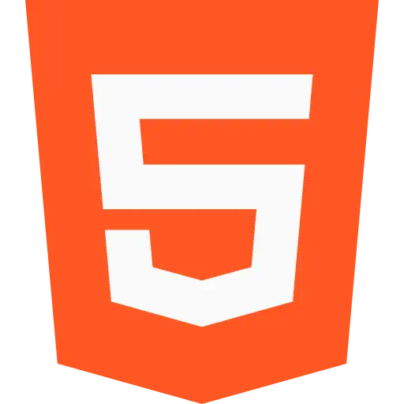
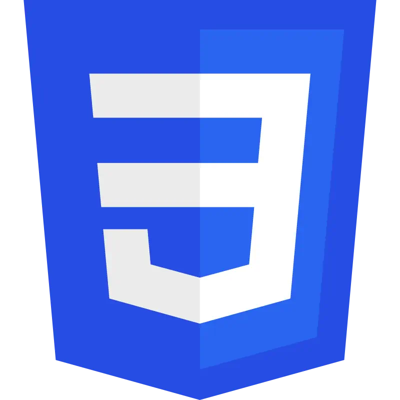
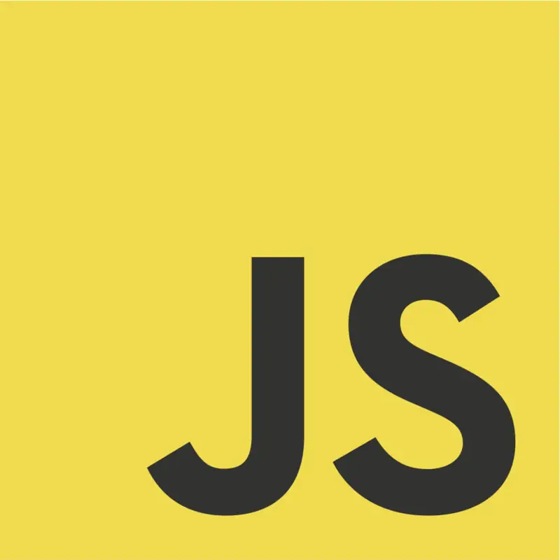
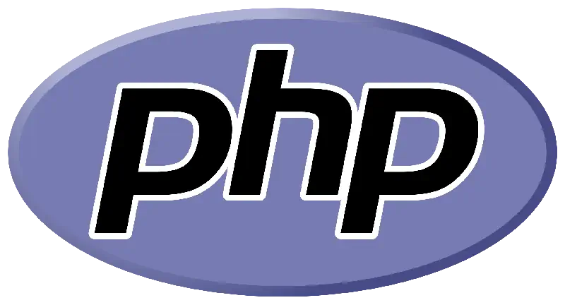
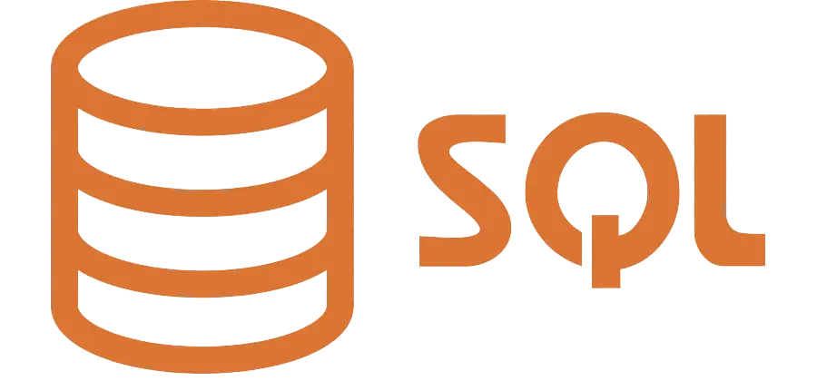
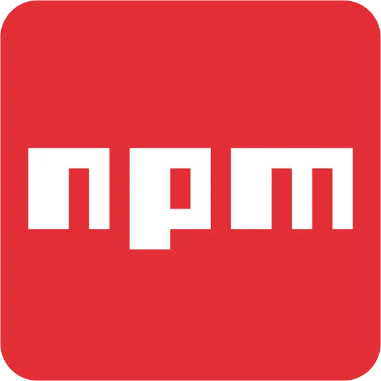
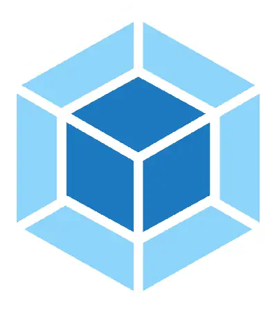
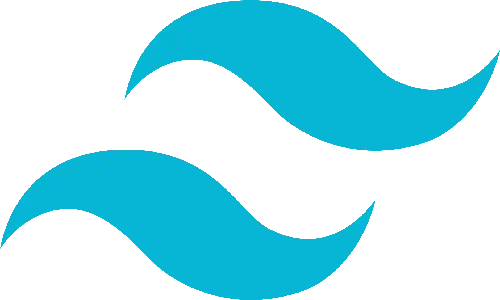
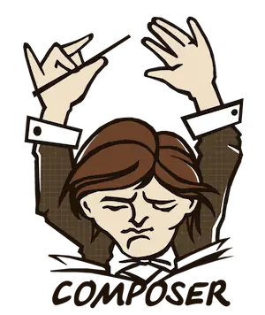

# Greetings ! :wave:
I'm Ambroise, I'm a french Web Developper and this is my GitHub :)

## About myself
### Web Development :computer:
This is my first activity. I'm studying since May 15th, 2023.
I'm starting to have solid bases in the Front End part and now currently learning Back End in parallel.

### My Coding Passion :sunglasses:
I love to create some little things like a discord bot, or modding my favourite games :eyes:.
I created a general bot in my private discord server (repo on github soon), and some
mods on various games like Curious Expedition, Civ 6 or Minecraft for fun.

## My workbench
### I can speak... ✨

    &emsp;
    &emsp;
    &emsp;
    &emsp;
    &emsp;

### My Tools 🛠️

    &emsp;
    &emsp;
    &emsp;
    &emsp;
    
    
    

## You can reach me by...
[LinkedIn](https://www.linkedin.com/in/ambroise-maire/)
or
[my mail](ambroise.maire7@gmail.com).
